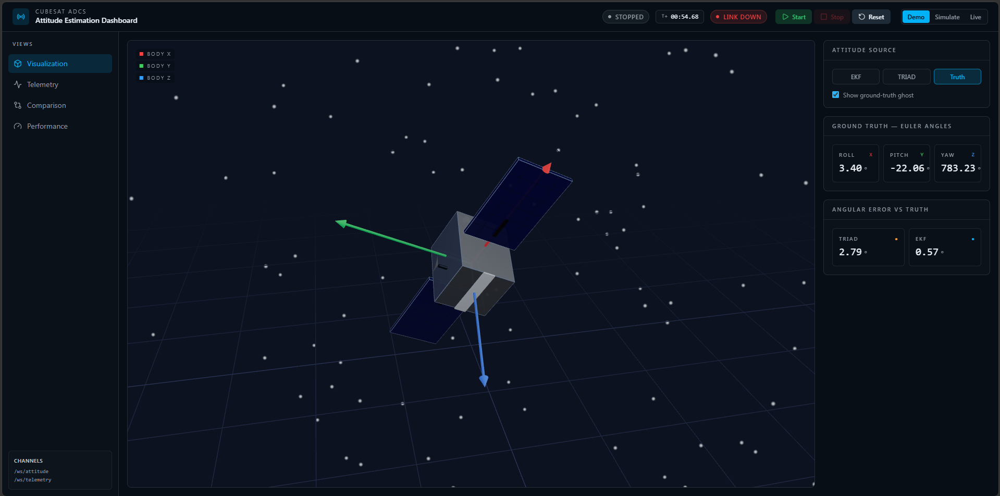
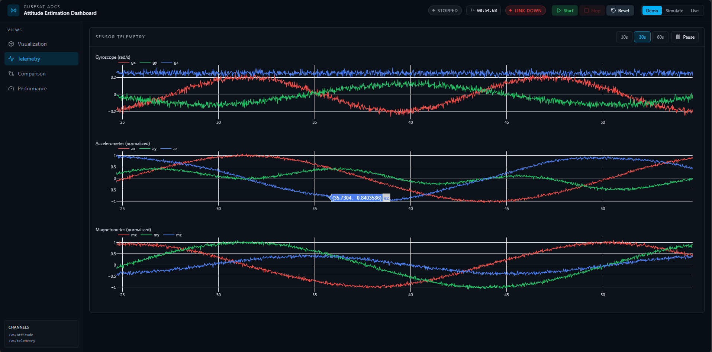
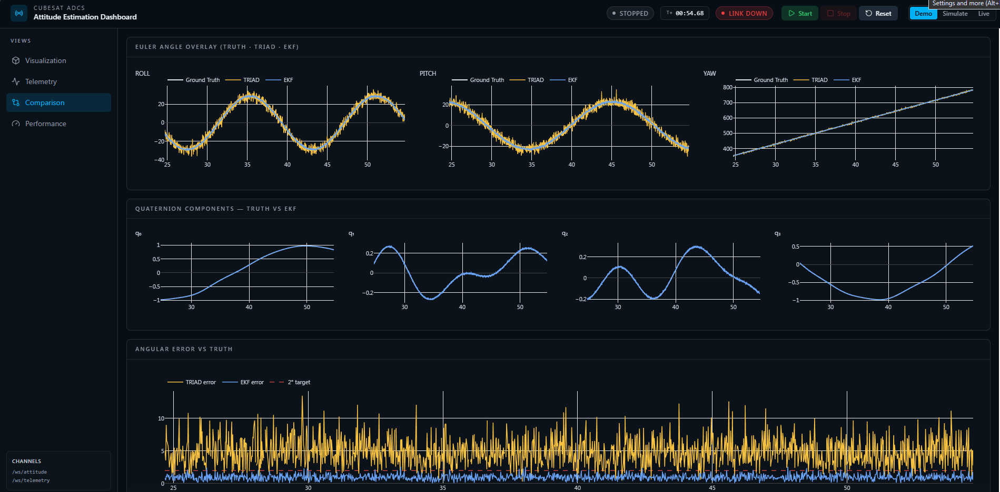
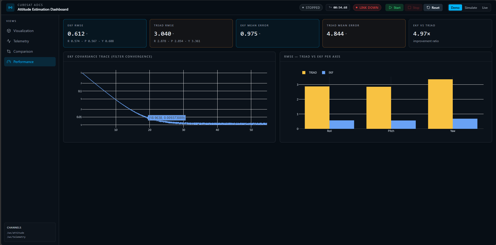

# CubeSat ADCS — Attitude Estimation Dashboard

A full-stack real-time simulator for spacecraft **Attitude Determination and Control Systems (ADCS)**. The system generates synthetic CubeSat rotational motion, fuses noisy IMU and magnetometer data through two algorithms (TRIAD and Extended Kalman Filter), and streams all estimates live to an interactive React dashboard.


---

## Screenshots

| View | Description |
|------|-------------|
|  | **3D Attitude Visualization** — real-time CubeSat body-frame render with selectable attitude source (EKF / TRIAD / Ground Truth) and ghost overlay |
|  | **Sensor Telemetry** — live time-series of gyroscope (rad/s), accelerometer, and magnetometer across all three axes |
|  | **Estimator Comparison** — Euler angle overlay (Truth · TRIAD · EKF), quaternion components, and angular error vs ground truth |
|  | **Performance Metrics** — per-axis RMSE, mean angular error, EKF vs TRIAD improvement ratio, and filter convergence trace |

---

## What This Project Does

A CubeSat in low Earth orbit tumbles continuously. Without knowing its orientation (attitude), it cannot point its solar panels, antennas, or cameras. This project simulates the full attitude determination pipeline:

1. **Physics simulation** — generates a realistic tumbling quaternion trajectory from orbital mechanics
2. **Sensor simulation** — produces gyroscope, accelerometer, and magnetometer readings with Gaussian noise and bias drift
3. **TRIAD algorithm** — deterministic, instantaneous attitude estimate from two reference vector pairs (gravity + magnetic field)
4. **Extended Kalman Filter (EKF)** — recursive 7-state filter (quaternion + gyro bias) that fuses all three sensors over time and outperforms TRIAD by ~5× in steady state
5. **Performance evaluation** — computes RMSE and mean angular error per axis vs ground truth, live-updated as the simulation runs
6. **Real-time streaming** — FastAPI broadcasts attitude and sensor frames over WebSocket at 100 Hz
7. **Dashboard** — React application with 3D viewer, live charts, and comparison analytics

---

## Key Results

From the Performance view (demo run):

| Metric | EKF | TRIAD |
|--------|-----|-------|
| RMSE | **0.612°** | 3.040° |
| Mean error | **0.975°** | 4.844° |
| **Improvement ratio** | **4.97× better** | — |

The EKF covariance trace converges from ~0.5 to ~0.009 in roughly 20 seconds, confirming filter convergence.

---

## Architecture

```
┌─────────────────────────────────────────────────────────────┐
│                        Backend (FastAPI)                    │
│                                                             │
│  CircularOrbit ──► SensorSimulator ──► TRIAD               │
│                           │                └──► Performance │
│                           └────────────► EKF    Evaluator  │
│                                                     │       │
│  REST API:  /simulation/{start,stop,reset,configure}│       │
│             /simulation/status   /performance/summary│       │
│                                                     │       │
│  WebSocket: /ws/attitude  ◄─────────────────────────┘       │
│             /ws/telemetry                                   │
└─────────────────────┬───────────────────────────────────────┘
                      │  HTTP + WebSocket
┌─────────────────────▼───────────────────────────────────────┐
│                   Frontend (React / TanStack)                │
│                                                             │
│  useBackendFeed ──► attitudeStore ──► Visualization (3D)   │
│                 ──► telemetryStore ──► Telemetry (charts)  │
│                 ──► comparisonStore ──► Comparison         │
│                 ──► performanceStore ──► Performance       │
│                                                             │
│  useDemoFeed (synthetic 50 Hz feed, no backend required)   │
└─────────────────────────────────────────────────────────────┘
```

---

## Operating Modes

The top bar contains a **Demo · Simulate · Live** selector:

### Demo
Fully client-side synthetic data feed running at 50 Hz in the browser. No backend needed. Use this to explore the dashboard immediately.

- Generates a precessing quaternion trajectory with realistic noise
- Populates all charts, the 3D viewer, and performance metrics
- Start / Stop / Reset controls work locally

### Simulate
Connects to the Python backend, which runs a physics-based simulation loop at 100 Hz. All values are generated by the orbital mechanics and sensor models.

> An amber notice banner appears at the top of every page reminding operators that values are model outputs, not real satellite data.

- Click **Start** to begin; the backend streams attitude and telemetry frames via WebSocket
- All four dashboard views update live from real backend data
- Performance metrics poll `/performance/summary` every 2 s

### Live
Fetches a real TLE (Two-Line Element) orbit for the ISS (NORAD ID 25544) and propagates the trajectory using SGP4. Sensor readings are modelled from the real orbital geometry and IGRF magnetic field model.

> Panels that compare against ground truth (Angular Error, RMSE, Comparison charts) show a **"Live value not available"** overlay, because true attitude cannot be independently verified from TLE data alone.

---

## Quick Start

Two terminals required.

### Terminal 1 — Backend

```bash
cd backend

# First time
pip install -r requirements.txt

# Start
uvicorn app.api.main:app --reload --port 8000
```

API docs: **http://localhost:8000/docs**

### Terminal 2 — Frontend

```bash
cd frontend

# First time
npm install

# Start
npm run dev
```

Dashboard: **http://localhost:8080**

---

## Project Structure

```
CubeSat/
├── backend/
│   ├── app/
│   │   ├── ekf/
│   │   │   ├── quaternion.py      # Quaternion math (Hamilton product, rotation, slerp)
│   │   │   ├── kinematics.py      # Attitude kinematics (omega matrix, integration)
│   │   │   ├── jacobians.py       # EKF Jacobian matrices (F, H)
│   │   │   └── ekf.py             # 7-state EKF (quaternion + gyro bias)
│   │   ├── triad/
│   │   │   └── __init__.py        # TRIAD algorithm (two-vector attitude solution)
│   │   ├── simulation/
│   │   │   ├── orbit.py           # Circular orbit + IGRF magnetic field model
│   │   │   └── sensor_sim.py      # Gyro / accel / mag with noise and bias drift
│   │   ├── evaluation/
│   │   │   └── evaluator.py       # RMSE, angular error, per-axis statistics
│   │   └── api/
│   │       ├── main.py            # FastAPI app, REST + WebSocket endpoints
│   │       ├── simulation_engine.py  # Asyncio simulation loop, mode management
│   │       └── ws_manager.py      # WebSocket connection pool and broadcaster
│   ├── tests/                     # 152 tests (EKF, TRIAD, simulation, API)
│   ├── scripts/
│   │   └── validate_ekf.py        # Standalone EKF validation script
│   └── requirements.txt
│
├── frontend/
│   └── src/
│       ├── routes/
│       │   ├── __root.tsx         # Root layout (SimulationBar + NavBar + DataFeeds)
│       │   ├── index.tsx          # Visualization page (3D + attitude readout)
│       │   ├── telemetry.tsx      # Sensor telemetry charts
│       │   ├── comparison.tsx     # TRIAD vs EKF vs Truth comparison
│       │   └── performance.tsx    # RMSE metrics + convergence chart
│       ├── components/
│       │   ├── cubesat/           # Three.js CubeSat mesh + scene
│       │   ├── charts/            # Plotly chart wrappers (7 chart types)
│       │   ├── layout/            # SimulationBar (mode selector + controls) + NavBar
│       │   ├── panels/            # Panel, MetricCard, AttitudeReadout, QuaternionDisplay
│       │   └── ui/                # LiveUnavailableMask, SimulationModeBanner, shadcn/ui
│       ├── hooks/
│       │   ├── useBackendFeed.ts  # WS consumer for simulate/live → fans into all stores
│       │   ├── useDemoFeed.ts     # Synthetic 50 Hz feed for demo mode
│       │   ├── useWebSocket.ts    # WebSocket with exponential backoff reconnect
│       │   └── useSimulationStatus.ts  # REST status poller (simulate/live only)
│       ├── stores/                # Zustand stores (attitude, telemetry, comparison, performance, simulation)
│       └── lib/api/
│           └── client.ts          # Axios client + simulationApi + performanceApi
│
└── docs/
    ├── system/SYSTEM_OVERVIEW.md
    ├── backend/PHASE1_MATH.md     # EKF derivation
    ├── backend/PHASE2_TRIAD_MATH.md
    └── frontend/FRONTEND_SPEC.md
```

---

## REST API Reference

| Method | Endpoint | Description |
|--------|----------|-------------|
| `GET` | `/health` | Health check |
| `GET` | `/simulation/status` | Current state, elapsed time, step count |
| `POST` | `/simulation/start` | Start simulation loop |
| `POST` | `/simulation/stop` | Stop simulation loop |
| `POST` | `/simulation/reset` | Reset to initial state |
| `POST` | `/simulation/configure` | Update simulation parameters |
| `GET` | `/attitude/current` | Latest attitude frame (REST snapshot) |
| `GET` | `/performance/summary` | RMSE and error metrics |
| `WS` | `/ws/attitude` | Live attitude stream (ground truth + TRIAD + EKF) |
| `WS` | `/ws/telemetry` | Live sensor stream (gyro + accel + mag) |

### Simulation Configuration

```bash
curl -X POST http://localhost:8000/simulation/configure \
  -H "Content-Type: application/json" \
  -d '{
    "mode": "simulation",
    "dt": 0.01,
    "altitude_km": 500,
    "tumble_rate_deg_s": 0.1,
    "sigma_gyro": 0.005,
    "sigma_accel": 0.05,
    "sigma_mag": 0.02
  }'
```

Set `"mode": "live"` with an optional `"norad_id"` (default: 25544 — ISS) for real TLE propagation.

---

## Algorithm Background

### TRIAD

Constructs an attitude matrix from two reference vectors (gravity and magnetic field) measured in both the body frame (sensors) and inertial frame (orbital model). Deterministic — one estimate per measurement, no history. Fast but sensitive to sensor noise.

### Extended Kalman Filter (7-state)

**State vector:** `[q₀, q₁, q₂, q₃, b_x, b_y, b_z]` — unit quaternion + gyroscope bias

- **Predict step:** integrates quaternion kinematics using gyro measurements, propagates covariance through linearised dynamics (Jacobian F)
- **Update step:** fuses accelerometer (gravity reference) and magnetometer (field reference) to correct quaternion drift, applies linearised observation model (Jacobian H)
- **Convergence:** covariance trace typically drops from ~0.5 to ~0.01 within 20 s at 100 Hz

The EKF accumulates information across time, making it robust to individual noisy measurements. TRIAD has no such memory, which explains the ~5× accuracy gap.

---

## Tech Stack

### Backend
| Package | Version | Role |
|---------|---------|------|
| FastAPI | ≥0.111 | REST + WebSocket API |
| uvicorn | ≥0.30 | ASGI server |
| NumPy | ≥1.24 | Quaternion math, sensor models |
| SciPy | ≥1.11 | Numerical utilities |
| sgp4 | ≥2.22 | TLE orbit propagation (live mode) |
| pytest | ≥7.4 | 152 unit + integration tests |

### Frontend
| Package | Version | Role |
|---------|---------|------|
| React | 19 | UI framework |
| TanStack Router | 1.x | File-based routing with code splitting |
| TanStack Start | 1.x | SSR + Vite/Nitro build |
| Three.js / React Three Fiber | 9.x | 3D CubeSat visualization |
| Plotly.js | 3.x | Interactive time-series and bar charts |
| Zustand | 5.x | Global state (5 stores) |
| Axios | 1.x | REST API client |
| Tailwind CSS | 4.x | Utility-first styling |
| TypeScript | 5.x | End-to-end type safety |

---

## Running Tests

```bash
cd backend
python -m pytest tests/ -v
```

152 tests covering:
- Quaternion math (Hamilton product, normalization, slerp)
- TRIAD correctness (known reference vectors)
- EKF convergence and bias estimation
- Sensor simulator statistics
- Performance evaluator RMSE computation
- Full API integration (start/stop/reset/configure/WebSocket)

---

## Environment Variables

No environment variables are required for local development.

To override the backend URL (different machine or port), create `frontend/.env.local`:

```
VITE_API_BASE_URL=http://your-host:8000
```

The WebSocket URL is derived automatically (`http://` → `ws://`).
